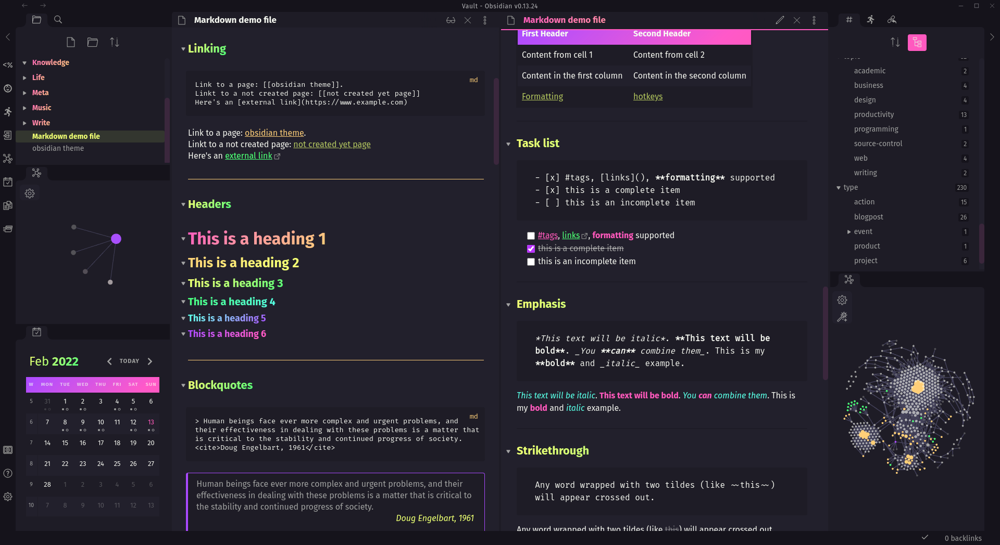

# Royal Velvet Obsidian Theme

A theme for [Obsidian](https://obsidian.md/), inspired by the beautiful colours of [Royal Velvet Obsidian](https://duckduckgo.com/?t=ffab&q=Mexican+Royal+Velvet+Obsidian&iax=images&ia=images) and the distinct colours used in programming syntax highlighting themes.



## Emoji in and headings

If you use emoji in headings, you will need to add a plugin to make these display in the right colour in reading mode. Install and enable the [Dynamic Highlights](obsidian://show-plugin?id=obsidian-dynamic-highlights) plugin, and import the following code in that plugin's settings:

```json
{
  "emoji": {
    "class": "emoji",
    "color": "",
    "regex": true,
    "query": "\\p{Extended_Pictographic}",
    "mark": ["match", "start", "end"],
    "css": ".emoji { color:black;  -webkit-text-fill-color: black; }"
  }
}
```

## Feedback

If you have any issues or suggestions, please [submit an issue](https://github.com/caro401/royal-velvet/issues/new) or raise a [pull request](https://github.com/caro401/royal-velvet/pulls/).

I don't use many plugins or advanced features of Obsidian, so there's defintely some usecases that won't look good - please let me know!

[](https://ko-fi.com/U6U7BUEZ6)
